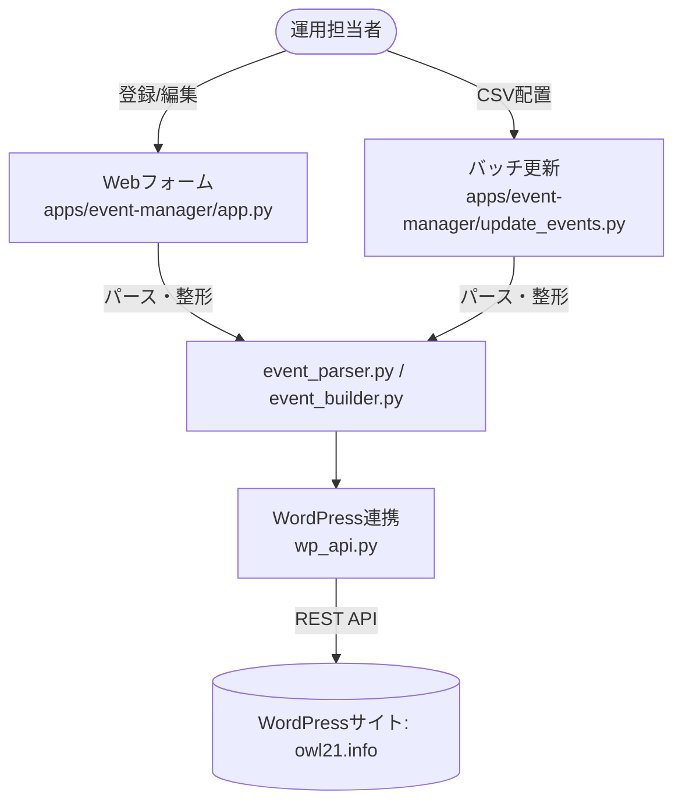
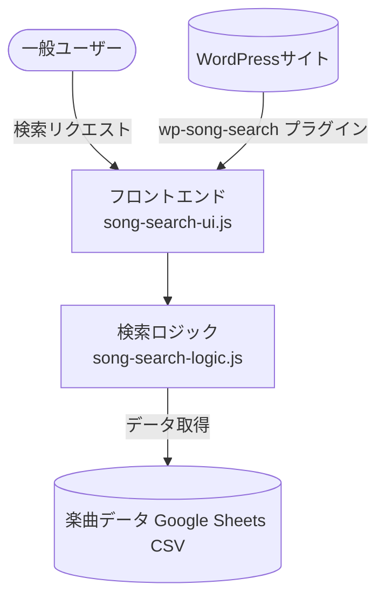

# システムアーキテクチャ・設計書

## 1. 全体構成

本システムは、以下の主要サブシステムから構成されています。
1. **イベント管理・Webフォーム (`apps/event-manager/app.py`)**
2. **スケジュール一括更新バッチ (`apps/event-manager/update_events.py` / `services/schedule-batch/`)**
3. **セッティングシート作成ツール (`apps/setting-sheet/`)**
4. **特設LP群 (`apps/owlstarsfes2026/`, `apps/freeLabo/`)**
5. **WordPress連携プラグイン群 (`services/wordpress-sync/`)**

これらはPythonバックエンド（`apps/event-manager/`）や静的Webフロントエンドから構成され、外部のWordPressサイト（`owl21.info`）と連携してデータの同期を行います。

## 2. コンポーネント間連携フロー

### イベント管理・更新フロー

### 楽曲検索システム

## 3. 主要モジュールの設計詳細

### 3.1. `apps/event-manager/app.py`
- **役割**: イベント登録・編集・抽出、チケット予約情報作成のためのFlask Webアプリケーション。
- **技術スタック**: Python (Flask) / Jinja2 / Vanilla JS
- **依存関係**: `wp_api.py`, `event_parser.py`, `event_builder.py` を呼び出し、入力されたイベントデータをWordPressに送信。

### 3.2. `apps/event-manager/update_events.py`
- **役割**: `shared/data/events.csv` などの一括データファイルを読み込み、The Events Calendarにスケジュールを一括更新するバッチ処理。
- **データフロー**: CSV読み込み -> データ検証 -> `event_parser.py` で整形 -> `wp_api.py` 経由で更新。
- **エラーハンドリング**: 更新ログ (`shared/data/update_log.txt`) に結果やエラーを出力。

### 3.3. `apps/event-manager/wp_api.py`
- **役割**: WordPress REST API（The Events Calendar APIおよびメディアアップロードAPI）と通信するためのラッパーモジュール。
- **責務**: Application Passwords認証情報の管理、リクエストの組み立て、レスポンスのパース、エラー処理（タイムアウトやAPI制限へのリトライ対応）。

### 3.4. 楽曲検索システム (`services/wordpress-sync/plugins/wp-song-search/`)
- **役割**: GoogleスプレッドシートのCSVと連動して動く高速な楽曲検索WordPressプラグイン。
- **埋め込み**: ショートコード `[song_search]` により固定ページに埋め込み。
- **アーキテクチャ**: Logic層（`song-search-logic.js`）とUI層（`song-search-ui.js`）の完全分離。

### 3.5. セッティングシート作成ツール (`apps/setting-sheet/`)
- **役割**: 出演者向けステージ機材配置図の作成・画像/PDFエクスポートWebツール。
- **アーキテクチャ**: Vanilla JS ES Modules（Store / Logic / UI / DragDrop）、SVGアセット、SSH自動デプロイ機能。

## 4. データ設計方針
- イベント情報、スケジュール情報、楽曲情報などは、ポータビリティの高いフォーマット（CSV, JSON）を中間データとして利用。
- `config.json` により環境非依存（APIエンドポイントや認証情報の外部化）を実現。

## 5. 保守・拡張について
- **新規バッチ追加時**: `apps/event-manager/` 内にスクリプトを追加し、必要に応じて `services/schedule-batch/` にシェルスクリプトを追加。
- **フロントエンドの改修**: UI改修とロジック改修の分離設計（Logic層はDOM非依存の純粋関数）を維持すること。
